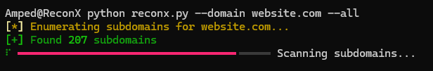
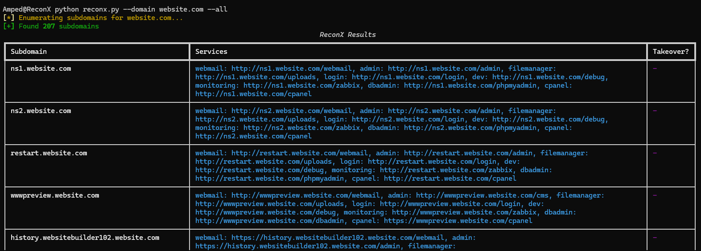

# ReconX

<div align="center">


```
██████╗ ███████╗ ██████╗ ██████╗ ███╗   ██╗██╗  ██╗
██╔══██╗██╔════╝██╔════╝██╔═══██╗████╗  ██║╚██╗██╔╝
██████╔╝█████╗  ██║     ██║   ██║██╔██╗ ██║ ╚███╔╝ 
██╔══██╗██╔══╝  ██║     ██║   ██║██║╚██╗██║ ██╔██╗ 
██║  ██║███████╗╚██████╗╚██████╔╝██║ ╚████║██╔╝ ██╗
╚═╝  ╚═╝╚══════╝ ╚═════╝ ╚═════╝ ╚═╝  ╚═══╝╚═╝  ╚═╝
        Subdomain Reconnaissance Tool
```

*A powerful subdomain reconnaissance tool for security researchers and penetration testers*

[](https://www.python.org/downloads/)
[](LICENSE)
[](https://github.com/ampedwastaken/ReconX/releases)

</div>

ReconX helps you discover and analyze subdomains of target domains with advanced service detection, subdomain takeover checks, and comprehensive scanning capabilities.

## Features

- Fast subdomain enumeration using subfinder
- Detection of common services:
  - Webmail systems
  - Admin panels
  - File managers
  - Login portals
  - Development endpoints
  - Monitoring systems
  - Database administration
  - cPanel instances
- Subdomain takeover vulnerability detection
- Multi-threaded scanning for improved performance
- Beautiful console output using Rich
- JSON export capability
- Configurable service scanning
- **NEW: Fully configurable through JSON files**
  - Add custom service paths and keywords
  - Modify HTTP headers and timeouts
  - Customize access denied messages
  - Add new service types without code changes

## Screenshots

<div align="center">

<!-- scanning -->


*Scanning in Action*

<!-- service detection -->


*Service Detection in Action*

<!-- takeover detection -->


*Subdomain Takeover Detection*

</div>

## Installation

1. Clone the repository:
```bash
git clone https://github.com/ampedwastaken/ReconX.git
cd ReconX
```

2. Install the required Python packages:
```bash
pip install -r requirements.txt
```

3. Install subfinder:
```bash
GO111MODULE=on go get -v github.com/projectdiscovery/subfinder/v2/cmd/subfinder
```

## Configuration

ReconX uses JSON configuration files located in the `config` directory:

### services.json
This file defines the services to scan for and their detection patterns:
```json
{
    "service_name": {
        "paths": ["/path1", "/path2"],
        "keywords": ["keyword1", "keyword2"]
    }
}
```

To add a new service:
1. Open `config/services.json`
2. Add a new service entry with paths and keywords
3. Restart ReconX - the new service will be automatically available

### settings.json
This file contains general settings:
- HTTP headers
- Request timeout
- Maximum worker threads
- Access denied messages
- Fingerprints URL

## Usage

Basic usage:
```bash
python reconx.py --domain example.com
```

Scan for specific services:
```bash
python reconx.py --domain example.com --webmail --admin --login
```

Scan all services and check for takeover vulnerabilities:
```bash
python reconx.py --domain example.com --all --takeover
```

Export results to JSON:
```bash
python reconx.py --domain example.com --all --json results.json
```

### Command Line Arguments

- `--domain`: Target domain (required)
- `--webmail`: Check for webmail services
- `--admin`: Check for admin panels
- `--filemanager`: Check for file managers
- `--login`: Check for login portals
- `--dev`: Check for development endpoints
- `--monitoring`: Check for monitoring systems
- `--dbadmin`: Check for database administration panels
- `--cpanel`: Check for cPanel instances
- `--all`: Check for all services
- `--takeover`: Check for subdomain takeover vulnerabilities
- `--json`: Export results to JSON file
- `--onlylive`: Only scan live subdomains

## Contributing

### Submit Your Service Scanners! 🚀

We encourage the community to share their service scanner configurations! If you've created effective patterns for detecting specific services, please contribute them to help the entire security community.

**How to Submit a Service Scanner:**

1. Fork the repository
2. Add your service configuration to `config/services.json` following this template:
```json
{
    "your_service_name": {
        "paths": [
            "/common/path1",
            "/common/path2"
        ],
        "keywords": [
            "unique identifier 1",
            "unique identifier 2"
        ]
    }
}
```
3. Test your configuration thoroughly
4. Submit a Pull Request with:
   - Description of the service
   - Why these paths and keywords are effective
   - Any examples of successful detections

**Service Scanner Guidelines:**
- Choose unique and specific paths
- Include distinctive keywords that appear in the service's interface
- Avoid generic terms that might cause false positives
- Consider common variations and implementations
- Document any specific detection nuances

Your contributions help make ReconX more powerful and comprehensive! 💪

### Other Ways to Contribute

1. Improving existing service patterns
2. Adding new features
3. Reporting bugs
4. Enhancing documentation
5. Sharing success stories and use cases

## License

This project is licensed under the MIT License - see the [LICENSE](LICENSE) file for details.

## Disclaimer

This tool is for educational and research purposes only. Users are responsible for complying with applicable laws and regulations. The author is not responsible for any misuse or damage caused by this tool. 